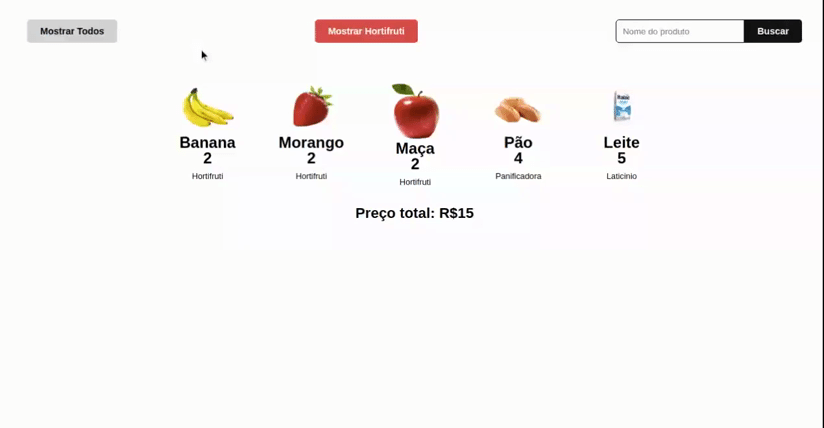

# Entrega: Lista de Produtos

## Introdução

Para começar, faça clone deste repositório.

Nesta entrega, iremos trabalhar os conceitos de manipulação de DOM e iteração sobre arrays e objetos. Lembre-se sempre de respeitar o conceito de imutabilidade.

O objetivo desta entrega é utilizar a manipulação de DOM para montar uma lista de produtos com alguns filtros (como busca, filtro por seção "Hortifruti") e, por fim, mostrar todos os produtos.



No projeto clonado você terá 3 arquivos, index.html, style.css e script.js.

Não se preocupe com a parte de estilização, as classes já estão criadas, porém, sinta-se livre para alterar caso ache necessário.

O foco principal da entrega será o JavaScript juntamente com a manipulação do DOM.

> **Aviso!**
> 
> Ao clonar o projeto, você verá dois arquivos JavaScript, sendo um deles para armazenar exclusivamente os dados que você irá utilizar e o segundo onde irá ser inserido sua lógica, lembre-se que a organização do seu projeto é tão importante quanto seu código. Nem sempre será só você que irá utilizar o projeto

## Tarefas

1. Construindo a Lista de Produtos
2. Adicionando os Filtros
3. Calculando o Preço Total

## Passo a Passo

### Passo 1 - Construindo a Lista de Produtos

A primeira coisa que precisamos fazer é construir a lista dos produtos na nossa página. Note que, no arquivo index.html do repositório clonado, já temos um modelo HTML para utilizarmos como base para criarmos os produtos de forma dinâmica, ou seja, através do DOM.

Para isso, vamos começar criando uma função chamada montarListaProdutos, que vai receber uma lista de produtos(um array de objetos) como parâmetro, dessa forma poderemos utilizar essa mesma função quando criarmos os filtros:

```js
function montarListaProdutos(listaProdutos) {
        
}
```

Sabendo que iremos receber uma array de produtos, então precisaremos percorrer essa lista. Utilizaremos o método forEach e, para cada produto, faremos a criação dos elementos html necessários, da seguinte forma:

```js
function montarListaProdutos(listaProdutos) {
    listaProdutos.forEach((produto) => {
        const li = document.createElement('li');
        const img = document.createElement('img');
        const h3 = document.createElement('h3');
        const p = document.createElement('p');
        const span = document.createElement('span');
    });
}
```

Após fazer a criação do elementos, precisamos adicionar os dados do produto nesses elementos. E então, poderemos adicionar os elementos ao li para, enfim, adicionar esse item, à nossa página HTML:

```js
// Selecionando elemento ul do HTML
const ul = document.querySelector('.containerListaProdutos ul');

function montarListaProdutos(listaProdutos) {
    listaProdutos.forEach((produto) => {
        const li = document.createElement('li');
        const img = document.createElement('img');
        const h3 = document.createElement('h3');
        const p = document.createElement('p');
        const span = document.createElement('span');

        // Adicionando dados do produto aos elementos
        img.src = produto.img;
        img.alt = produto.nome;
        h3.innerText = produto.nome;
        p.innerText = produto.preco;
        span.innerText = produto.secao;

        // Adicionando o elementos para o li
        li.appendChild(img);
        li.appendChild(h3);
        li.appendChild(p);
        li.appendChild(span);

        // Adicionando li ao HTML
        ul.appendChild(li);
    });
}
```

E pronto! Nossa lista de produtos já está sendo montada na página. Agora vamos para a construção dos filtros.

### Passo 2 - Adicionando os Filtros

Podemos observar, no GIF de exemplo acima, que temos três formas de filtrar nossos produtos. São elas:

1. Mostrar Hortifruti: Mostra a listagem apenas dos produtos que são da seção "Hortifruti";
2. Campo de busca: Filtra a listagem de produtos pelo nome do produto, inserido no campo;
3. Mostrar todos: Mostra a listagem de todos os produtos.

Nesse passo, irei mostrar como você pode fazer para filtrar os produtos por seção, ou seja, mostrar apenas os produtos que forem da seção do hortifruti.

Vamos começar declarando uma função chamada filtrarPorHortifruti:

```js
function filtrarPorHortifruti() {
            
}
```

Agora precisamos fazer o filtro de fato. Utilizaremos um método nativo do javascript, o filter. Esse método nos retorna uma nova array, ou seja, estaremos aplicando o conceito de imutabilidade.

Com o filter, podemos criar uma nova lista de produtos, que satisfaça a nossa condição, que é o produto fazer parte da seção hortifruti. Veja no código abaixo:

```js
function filtrarPorHortifruti() {
    const listaHortifruti = produtos.filter((produto) => {
        return produto.secao === 'Hortifruti';
    });
}
```

Por enquanto, estamos apenas filtrando a lista. Mas, agora, precisamos refletir esse filtro na nossa página HTML. Para isso, só precisamos chamar novamente nossa função montarListaProdutos, passando como parâmetro a nossa lista filtrada(listaHortifruti).

E, para executar a função, precisaremos adicionar um event listener ao botão responsável pode esse filtro:

```js
function filtrarPorHortifruti() {
    const listaHortifruti = produtos.filter((produto) => {
        return produto.secao === 'Hortifruti';
    });

    montarListaProdutos(listaHortifruti);

    // Selecionando botao em nosso HTML
    const botaoMostrarHortifruti = document.querySelector('.estiloGeralBotoes--filtrarHortifruti');

    // Adicionando event listener de clique, e executando a função de filtro
    botaoMostrarHortifruti.addEventListener('click', filtrarPorHortifruti);
}
```

E, por último, também precisaremos limpar a lista de produtos antes de criação de outra lista. Para isso, vamos adicionar mais uma linha de código no início da nossa função montarListaProdutos:

```js
function montarListaProdutos(listaProdutos) {
    ul.innerHTML = '';

    listaProdutos.forEach((produto) => {
    ...
}
```

> **Prática!**
> 
> E agora é com você! Utilize esse exemplo de criação de filtros como base para fazer os outros dois, Campo de Busca e Mostrar Todos!
> 
> Em seguida, também utilize os conhecimentos adquiridos nos passos 1 e 2 para resolver os passo 3. Ou seja, fazer a atualização do preço total, baseado nos produtos que estiverem sendo mostrados na página. Sempre que um filtro for aplicado, o preço total precisa ser atualizado!

### Passo 3 - Calculando o Preço Total

Por fim mas não menos importante, o cálculo do preço total. Note que o cálculo, assim como a listagem, é dinâmico. Ou seja, seu valor muda de acordo com o valor dos produtos que estão sendo mostrados

1. Calcular dinamicamente o valor total dos produtos listados.

> **Dica!**
> 
> Lembre-se que, como visto antes, quando trabalhamos com arrays e objetos, temos muitas possibilidades de métodos para nos auxiliar a deixar nosso código mais enxuto e de fácil leitura. Escolha o mais adequado para as situações propostas.

## Extra

Agora que você já fez os pontos principais da entrega, sinta-se à vontade para criar mais tipos de filtros e deixar sua entrega ainda mais dinâmica.

## Envio

Faça o push do código para o seu repositório GitHub e implemente-o GitHub pages. No Canvas, por favor, envie sua url do GitHub Pages e envie o link do seu repositório nos comentários. Deixe o link do seu repositório como internal.
